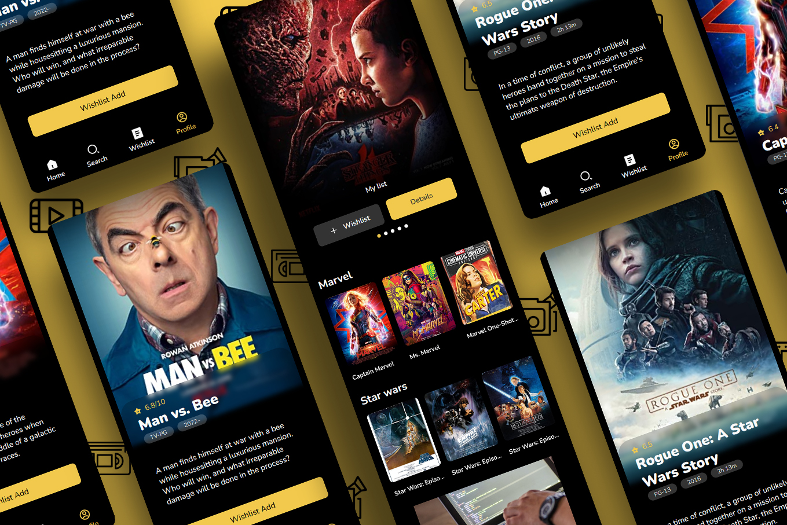

# [GRANIER Kévin](https://www.kevin-granier.fr/) Movie-app

|  | Un projet React avec l'API Omdb. Permettant de crée un profil et une wishlist de vos films préférés. |
| ----------------- | ----------------- |

<br/>

--------------------------------------------------

<br/>

# This project was bootstrapped with [Create React App](https://github.com/facebook/create-react-app).

## The project his host on GitHub : [hoop30.github.io/e-com/](https://hoop30.github.io/movie-app/)
  
<br/>

--------

<br/>
  
## You can run it localy by git clone

```bash
git clone https://github.com/hoop30/movie-app.git
```

### Available Scripts

In the project directory, you can run:

```bash
npm start
```
Runs the app in the development mode.\
Open [http://localhost:3000](http://localhost:3000) to view it in your browser.

The page will reload when you make changes.\
You may also see any lint errors in the console.

```bash
npm test
```

Launches the test runner in the interactive watch mode.\
See the section about [running tests](https://facebook.github.io/create-react-app/docs/running-tests) for more information.
